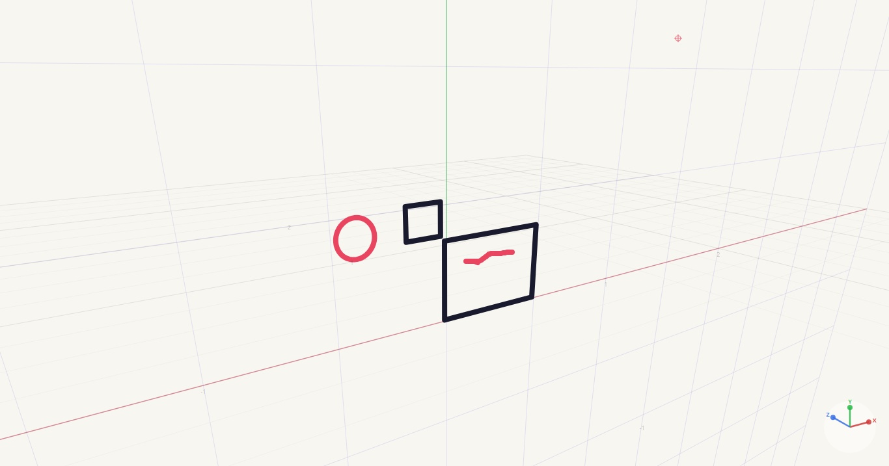

# Arte

**Arte** es una aplicación de dibujo vectorial 3D con perspectiva real, construida con [Tauri v2](https://tauri.app/) + Rust + JavaScript.

Crea ilustraciones en el espacio 3D, orbita la cámara libremente, organiza tus trazos en capas y exporta a **SVG**, **JPG** y **OBJ** (malla 3D).



## Descargar

**[⬇ Descargar Arte v0.1.4](https://github.com/oweeme/arte/releases/tag/v0.1.4)**

| Plataforma | Archivo |
|---|---|
| Linux | `.deb` `.rpm` `.AppImage` |
| Windows | `.msi` `.exe` |
| macOS | `.dmg` |
| Android | `.apk` |

---

## Características

- **Dibujo vectorial en 3D** — trazos con perspectiva real proyectados sobre planos XY, XZ o YZ
- **Cámara libre** — orbita, zoom y paneo con ratón / trackpad
- **Capas** — crea, oculta, bloquea y reordena capas
- **Pinceles** — redondo, cuadrado y plano; control de grosor y opacidad
- **Exportación** — SVG, JPG y OBJ (modelo 3D con material MTL)
- **Formato nativo `.arte`** — guarda y carga proyectos completos
- **Modo presentación** — oculta la UI para mostrar solo el lienzo
- **Multiplataforma** — Linux, Windows, macOS y Android

---

## Requisitos

| Herramienta | Versión mínima |
|---|---|
| [Rust](https://rustup.rs/) | 1.77 |
| [Node.js](https://nodejs.org/) | 20 |
| [Tauri CLI](https://tauri.app/start/) | 2.x |

### Linux — dependencias adicionales

```bash
sudo apt install libwebkit2gtk-4.1-dev libgtk-3-dev libayatana-appindicator3-dev librsvg2-dev
```

---

## Instalación y desarrollo

```bash
# 1. Clonar
git clone https://github.com/oweeme/arte.git
cd arte

# 2. Instalar dependencias Node
npm install

# 3. Arrancar en modo desarrollo
npm run tauri dev
```

---

## Compilar para producción

```bash
npm run tauri build
```

Los instaladores se generan en `src-tauri/target/release/bundle/`:

| Plataforma | Formato |
|---|---|
| Linux | `.deb`, `.rpm`, `.AppImage` |
| Windows | `.msi`, `.exe` (NSIS) |
| macOS | `.dmg`, `.app` |
| Android | `.apk`, `.aab` |

---

## Estructura del proyecto

```
arte/
├── src/                  # Frontend (HTML + CSS + JavaScript)
│   ├── index.html
│   ├── main.js           # Motor de dibujo 3D, cámara, capas, UI
│   └── styles.css
├── src-tauri/            # Backend Rust (Tauri v2)
│   ├── src/
│   │   ├── motor_3d/     # Proyección, trazos, exportación
│   │   └── comunicacion/ # Comandos Tauri (guardar, cargar, exportar)
│   ├── tauri.conf.json
│   └── Cargo.toml
├── flatpak/              # Empaquetado Flatpak (Linux)
└── .github/workflows/    # CI/CD — builds automáticos por plataforma
```

---

## CI/CD — GitHub Actions

Al crear un tag `v*` se dispara el workflow automáticamente y genera los instaladores para todas las plataformas como GitHub Release.

```bash
git tag v0.1.0
git push origin v0.1.0
```

---

## Licencia

© 2025 Hector Martinez — [oweeme.com](https://oweeme.com)

Todos los derechos reservados.
